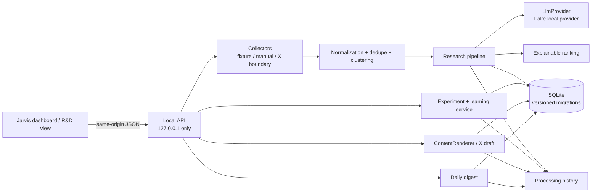

# R&D Intelligence MVP 技術文書

この文書は、`main`で管理するR&D Intelligence MVPの実装と運用境界を説明します。将来の構想を完成済みの機能として扱わないため、未実装項目を明示しています。

## 1. 目的とユーザーフロー

技術投稿を大量に読むことではなく、根拠を保ったまま次の行動へ変換することが目的です。

```text
Collect → Evaluate → Deduplicate / Cluster → Rank
       → Experiment proposal → User execution → Learn
       → X draft → Human review
```

Jarvisは実験の手順を提案・記録しますが、任意のコードやコマンドを実行しません。X下書きはコピーとレビューまでで、自動投稿しません。

## 2. Architecture



責務は次のように分離しています。

- `collectors`: 共通の `Collector` interfaceから投稿を返す。
- `application/normalization`: URL、本文hash、source IDを正規化する。
- `application/research-pipeline`: 保存、重複排除、分析、cluster、ranking、処理履歴を一つの縦切りにする。
- `providers`: `LlmProvider` interface。現在は外部通信しないfake providerのみ。
- `application/experiment-service`: 実験の状態遷移、結果、学習、イベントを記録する。
- `content`: `ContentRenderer`とX向けrenderer。Instagram向けの共通境界はあるが、連携は未実装。
- `storage/sqlite`: domain/applicationからSQLiteを分離するrepositoryとmigration。
- `api`: 同一オリジンのHTTP境界、runtime validation、静的asset allowlist。

## 3. Folder structure

```text
src/
  features/
    rd-intelligence/  Node.jsのR&D feature
      api/            Local API、request validation、静的asset配信
      application/    research pipeline、experiment、draft、digest、normalization
      cli/            db:init、fixture pipeline、local API起動
      collectors/     Collector interface、fixture、manual import、X boundary
      content/        platform rendererとevidence guard
      domain/         entities、enums、ranking、状態遷移
      logging/        structured loggingとredacted error context
      providers/      LlmProviderとfake provider
      storage/        repository interfaceとSQLite実装
      validation/     外部/LLM/API入力のruntime validation
  jarvis/             Python application foundation
ui/
  app/                React Router、App Shell、共通スタイル
  features/
    dashboard/        ルートのFeatureカード型ダッシュボード
    rd-intelligence/  R&D画面、API client、Feature固有スタイル
migrations/     番号付きSQLite migration
fixtures/       個人データを含まない合成source item
tests/          unit、integration、local API、closed-loop安全性
.github/workflows/ci.yml  PR/manual-only CI
```

## 4. Data model

主なSQLiteテーブルは次のとおりです。JSON列はrepository境界で型付きentityへ復元されます。

| 概念 | 主な内容 | 履歴・制約 |
| --- | --- | --- |
| `source_items` | source種別、外部ID、URL、本文、author、collected_at | source ID / normalized URL / content hashを一意化 |
| `topic_clusters` / `topic_cluster_items` | 同じ発表やrepositoryを扱うtopic | 元のsource itemは削除しない |
| `analyses` | 30秒要約、category、confidence、why it matters、実験候補、claims | provider/model/prompt/schema versionを保存 |
| `rankings` | relevance、novelty、actionability、author credibility、overall | 各0〜5、重み35/25/25/15、overall 0〜100 |
| `experiments` | 仮説、期待値、最初の一歩、リスク、成功基準、status | proposed→approved→in_progress→completed等 |
| `experiment_runs` | ユーザーが実行した結果と検証根拠 | run sequenceを保持 |
| `learnings` | hypothesis support、再利用知識、次の実験、一次体験 | 失敗も削除せず保存 |
| `content_drafts` | platform、Hook、本文、source links、status | Xは280 Unicode文字、evidence scopeを保存 |
| `processing_runs` | operation、provider、件数、retry、status、error | 失敗後も履歴を残す |
| `*_events` / `analysis_claims` | 状態遷移と分析claimの監査 | migration 002〜004で追加 |

MVPでは、sourceの固定語彙とsource-specific metadataを `SourceItem.sourceType` / `sourceMetadata` に保持しています。sourceごとの認証、cursor、rate limit、設定を永続化する必要が出た段階で、独立したSource registryを追加する拡張点です。現在Source registryを無理に分けていないのは、実接続が未承認で、fixture/manualの縦切りに不要なためです。

claimは次の区分で保存します。

- `FACT`: 出典から直接確認できる内容
- `OBSERVATION`: 限定サンプルで観察した内容
- `INFERENCE`: 根拠から導いた解釈
- `HYPOTHESIS`: 実験で検証すべき仮説
- `IDEA`: 提案

投稿者の主張を自動的にFACTへ昇格しません。X draftには出典、Jarvisの解釈、未検証仮説、完了済み実験の一次体験を別々のprovenanceとして保持します。

Migrationは番号順・transaction単位で適用し、checksum不一致や空のmigration directoryでは起動を拒否します。

Daily Digestは現在、指定したローカル日付の集計snapshotを生成して返すサービス/APIです。専用の `daily_digests` 永続テーブルはまだなく、集計結果そのものを履歴として保存する機能とは区別してください。

## 5. Local setup and environment

環境変数は現在使用していません。`.env`、X token、LLM key、RSS credentialは不要です。

```text
# Current MVP: no environment variables required.
# All paths and the port are explicit CLI options.
```

既定のローカル起動:

```bash
npm ci
npm run db:init
npm run pipeline:fixture
npm run api:local
```

ブラウザURLは `http://127.0.0.1:4317/` です。`api:local` はAPIと明示allowlistのUI assetを同じloopback originから配信します。Pythonの静的サーバーは既存の見た目を表示できますが、R&D APIは提供しないため、このMVPの操作には使いません。

CLI options:

```bash
npm run db:init -- --database data/demo.sqlite --migrations migrations
npm run pipeline:fixture -- --database data/demo.sqlite --fixture fixtures/source-items.json
npm run api:local -- --database data/demo.sqlite --migrations migrations --port 4317
```

`data/` とSQLiteファイルは `.gitignore` 対象です。fixtureは合成データであり、個人のKnowledge Baseや会話をコピーしません。

## 6. Local API

すべてのAPI応答は成功時 `{ "data": ... }`、境界エラー時 `{ "error": { "code": ..., "message": ... } }` です。APIは `127.0.0.1` にbindし、HostとOriginを同一loopback originに限定し、CORSヘッダーを出しません。

### Read and import

| Method | Path | Body / query | Result |
| --- | --- | --- | --- |
| GET | `/api/health` | なし | healthとbound host |
| GET | `/api/inbox?limit=1..200` | なし | `{items}` |
| POST | `/api/inbox/import` | `{items: RawSourceItem[]}` | processing run |
| GET | `/api/insights?limit=1..200` | なし | ranked insight list |
| GET | `/api/insights/:analysisId` | なし | analysis + ranking + source item |

`RawSourceItem`の必須値は `sourceType`、`title`、`author`、`content` です。`sourceType`は `x` / `zenn` / `qiita` / `manual` / `fixture`。`canonicalUrl`と`topicUrl`は資格情報を含まないhttp(s) URL、`publishedAt`はISO日時、`sourceMetadata`はJSON objectです。

例:

```bash
curl -sS -X POST http://127.0.0.1:4317/api/inbox/import \
  -H 'content-type: application/json' \
  --data '{"items":[{"sourceType":"manual","sourceExternalId":"manual-001","title":"Local note","author":"Local author","content":"A hypothesis to test locally.","sourceMetadata":{"synthetic":true}}]}'
```

### Experiments

| Method | Path | Body |
| --- | --- | --- |
| GET | `/api/experiments` | なし |
| GET | `/api/experiments/:id` | なし。experiment、runs、events、learning |
| POST | `/api/insights/:analysisId/experiments` | `title`, `hypothesis`, `expectedValue`, `smallestFirstStep`, `requiredTools[]`, `estimatedEffort`, `risk`, `successCriteria`, `verificationMethod` |
| POST | `/api/experiments/:id/approve` | `{}` |
| POST | `/api/experiments/:id/start` | `{}` |
| POST | `/api/experiments/:id/reject` | `{reason}` |
| POST | `/api/experiments/:id/block` | `{reason}` |
| POST | `/api/experiments/:id/complete` | required: `result`, `verificationEvidence`, `learned`, `nextDecision`, `hypothesisSupport`, `reusableKnowledge`; optional: `nextExperiment`, `publishableFirstHandExperience` |

`hypothesisSupport`は `supported` / `partially_supported` / `not_supported` / `inconclusive` です。実験のコマンドやコードはAPIから実行されません。

### X drafts and digest

| Method | Path | Body |
| --- | --- | --- |
| POST | `/api/insights/:analysisId/x-drafts` | `{}` または `{experimentId}` |
| GET | `/api/x-drafts` | なし |
| GET | `/api/x-drafts/:id` | なし。draftとreview events |
| PATCH | `/api/x-drafts/:id` | `hook`, `body`, `keyTakeaway`, `sourceLinks[]` |
| POST | `/api/x-drafts/:id/review` | `{}` |
| POST | `/api/x-drafts/:id/approve` | `{}` |
| POST | `/api/x-drafts/:id/reject` | `{reason}` |
| GET | `/api/processing-history?limit=1..200` | なし |
| POST | `/api/digests` | `{}` または `{localDate:"YYYY-MM-DD"}` |

X draftにはpublish endpointがありません。domain上の `published` は将来の手動記録用状態であり、MVPのHTTP APIから到達できません。生成済みのdraftを承認してもXには送信されません。

APIのJSON body上限は1 MiB、request/header/socketに有限timeoutがあります。未知の内部エラーは固定メッセージへredactされます。

## 7. UI

ReactのJarvisダッシュボードから `/rd-intelligence` へ遷移し、次のタブを操作できます。

- Inbox
- Ranked insights / detail
- Experiment queue / detail / result and learning
- X draft queue / edit / copy / human review
- Processing history

UIはReact／Vite／React Routerで、外部assetやブラウザ永続化を使用しません。`fetch`は同一originの相対 `/api/...` だけです。初期表示時に保存済みのローカルデータを読み、更新・取込・状態変更後に再読込します。ダッシュボードのR&Dカードには、レビュー待ち下書き数と未完了実験数を表示します。APIへ接続できない場合はオフライン状態を明示します。

画面にはpublish操作を置かず、X下書きは編集、コピー、レビュー、承認までに限定しています。DigestはHistoryタブから手動生成できます。定期実行や自動投稿はありません。

## 8. Security, privacy, and cost

- 外部ネットワーク、X/RSS/cloud LLM、credentials、`process.env`は現在使用しません。
- fake providerはローカル決定的出力です。したがってAPI利用料は発生しません。
- APIはloopbackのみ、CORSなし、Host/Origin検証あり。静的配信はallowlist assetだけです。
- ログにはsource本文、token、Authorization header、個人コンテンツを記録しない方針です。処理失敗はredacted error code/kindで保持します。
- `fixtures/source-items.json`は合成データです。実データを手動importする場合、SQLite、ログ、バックアップの保管期間と削除方針を利用者が決めてください。
- X draftの承認は公開許可ではありません。コピー後の投稿は人間が別途判断します。
- Node `node:sqlite`はNode 22系でexperimental warningが出ます。MVPでは依存を増やさず採用しています。

## 9. Extension points and TODO

### Replaceable providers

- `Collector`: X List Timeline、Zenn RSS、Qiita RSS、GitHub Releases、arXivなどを追加できる境界。実X collectorは現在 `CollectorNotConfiguredError` を返すだけです。
- `LlmProvider`: fake providerと同じ型付き分析schemaを満たす実providerを追加する。資格情報、費用、送信データ、retry、停止方法を別途設計する。
- `ContentRenderer`: X rendererと共通の `ContentDraft` 境界。Instagram renderer/API/自動投稿は未実装です。
- repository / scheduler boundary: SQLite以外の保存先や手動schedulerを将来追加できるが、MVPではcron・scheduleを有効化しません。

### TODO

- X API List Timelineを、承認済み資格情報と利用規約・rate limit確認後に実装する。
- Zenn / Qiita RSS collectorを、取得頻度・robots/利用規約・失敗時の再試行とともに実装する。
- 実LLM providerを、schema validation、cost ceiling、prompt/model version、個人データ送信の同意とともに追加する。
- topic clusteringを、決定的ルールから必要最小限の意味クラスタリングへ評価する。
- Instagram向けrendererを追加する（API投稿は実装しない）。
- データの削除/exportとretention UIを設計する。

## 10. Acceptance evidence

主要な受け入れ条件は `tests/` とブラウザ検証で確認しています。

- fixture再投入の重複排除: `tests/pipeline.test.ts`
- schema、ranking、claim区分: `tests/analysis-ranking.test.ts`
- experiment状態、learning、失敗履歴: `tests/experiment.test.ts`
- evidence guardと人間レビュー: `tests/content-draft.test.ts`
- API境界、静的asset、publish endpoint不在: `tests/local-api.test.ts`
- migration、logging、閉ループ外部通信境界: `tests/foundation.test.ts`, `tests/closed-loop.test.ts`
- UI主要フロー、keyboard、responsive、console: `ui-verify`ステージのローカルブラウザ検証

最終的な公開・pushはリポジトリ所有者が判断します。
